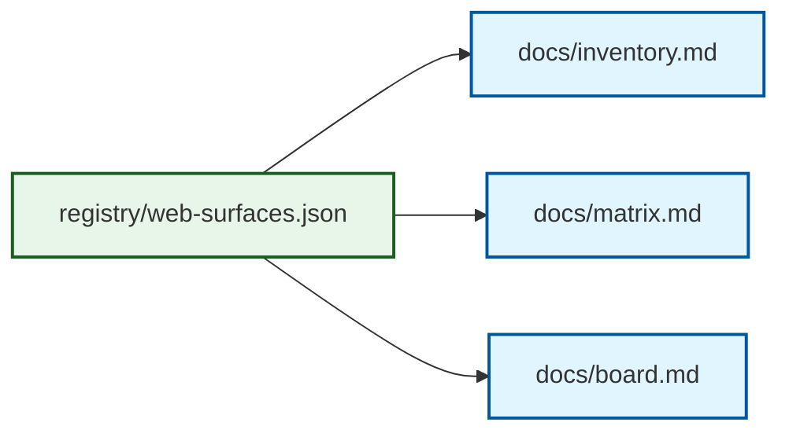

# OpenSIN Web Surface Plan

<a name="readme-top"></a>

> Single source of truth for OpenSIN-AI websites, subpages, owners, deploy targets, and canonical routes.

<p align="center">
  <a href="#quick-start">Quick Start</a> ·
  <a href="#layers">Layers</a> ·
  <a href="#docs">Docs</a> ·
  <a href="#registry">Registry</a>
</p>

<p align="center">
  
  
  
  
</p>

## What this is

This repo separates OpenSIN web presence into three layers:

1. **Inventory** — what exists.
2. **Matrix** — how domains, repos, deploys, auth, and routes connect.
3. **Board** — the operating rules and governance model.

## Layers



## Quick Start

```bash
git clone https://github.com/OpenSIN-AI/OpenSIN-Web-Surface-Plan.git
cd OpenSIN-Web-Surface-Plan
node scripts/validate-registry.mjs
node scripts/generate-docs.mjs
```

## Docs

- [`docs/board.md`](docs/board.md) — governance and architecture board
- [`docs/standards.md`](docs/standards.md) — best practices and maintenance rules
- [`docs/inventory.md`](docs/inventory.md) — generated surface inventory
- [`docs/matrix.md`](docs/matrix.md) — generated domain/repo/deploy matrix

## Registry

- [`registry/web-surfaces.json`](registry/web-surfaces.json) — canonical SSOT
- [`llms.txt`](llms.txt) — AI summary
- [`llms-full.txt`](llms-full.txt) — full AI context

## Principle

> Never guess a surface. If a route, deploy target, or owner is unverified, mark it unverified.

## Repository structure

```text
.
├── registry/web-surfaces.json
├── docs/
│   ├── board.md
│   ├── inventory.md
│   ├── matrix.md
│   └── standards.md
├── scripts/
│   ├── generate-docs.mjs
│   └── validate-registry.mjs
├── llms.txt
├── llms-full.txt
└── package.json
```

<p align="right">(<a href="#readme-top">back to top</a>)</p>
