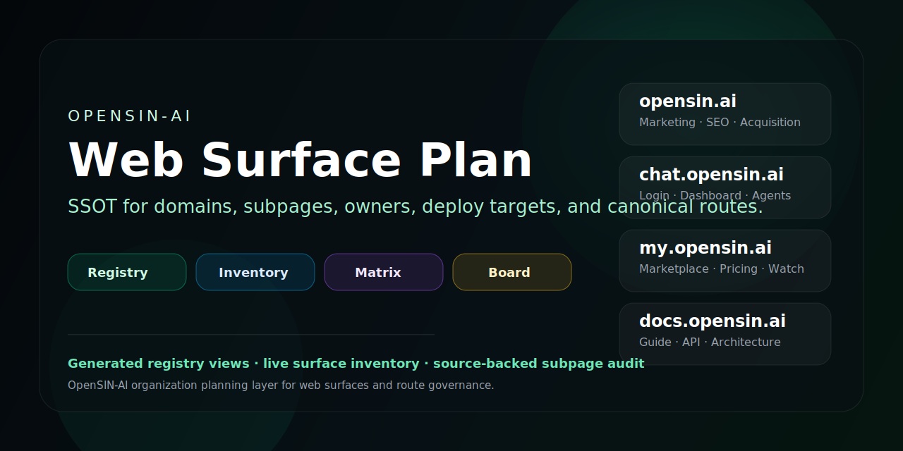
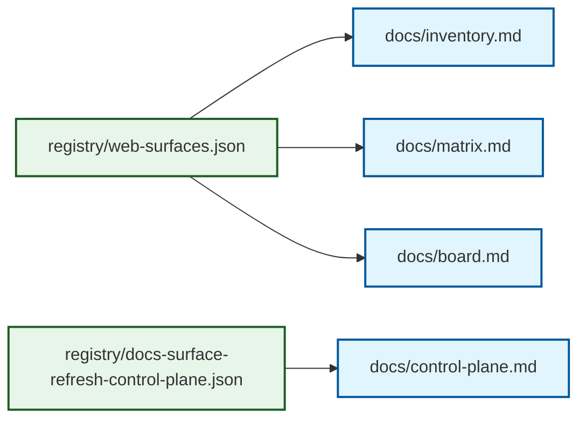

# OpenSIN Web Surface Plan

<a name="readme-top"></a>

> Single source of truth for OpenSIN-AI websites, subpages, owners, deploy targets, canonical routes, and cross-repo surface refresh control-plane policy.

<p align="center">
  <a href="#quick-start">Quick Start</a> ·
  <a href="#status-at-a-glance">Status</a> ·
  <a href="#layers">Layers</a> ·
  <a href="#docs">Docs</a> ·
  <a href="#registry">Registry</a>
</p>

<p align="center">
  
  
  
  
</p>

<p align="center">
  
</p>

## What this is

This repo separates OpenSIN web presence into four layers:

1. **Inventory** — what exists.
2. **Matrix** — how domains, repos, deploys, auth, and routes connect.
3. **Board** — the operating rules and governance model.
4. **Control plane** — dependency order, release policy, and cross-repo coordination for surface programs.

## Status at a glance

| Surface | State | Notes |
|---|---|---|
| `opensin.ai` | live | Public marketing + discovery surface |
| `chat.opensin.ai` | live / gated | Dashboard is live; some agent pages require login |
| `my.opensin.ai` | live | Marketplace and pricing surface |
| `blog.opensin.ai` | live | Cloudflare Pages blog |
| `docs.opensin.ai` | live | Docs canonical knowledge layer |
| `opensin.ai/agents` | 404 | Not live; do not market it as a public surface |
| `api.opensin.ai` | internal | Backend surface exists, but public DNS is not verified here |

For the full live probe report, see [`docs/live-audit.md`](docs/live-audit.md).

**Current probe summary:** 5 live · 2 gated · 3 DNS-missing · 2 missing/404

## Layers



## Quick Start

```bash
git clone https://github.com/OpenSIN-AI/OpenSIN-Web-Surface-Plan.git
cd OpenSIN-Web-Surface-Plan
node scripts/validate-registry.mjs
node scripts/validate-control-plane.mjs
node scripts/generate-docs.mjs
node scripts/generate-subpages.mjs
node scripts/live-audit.mjs
```

## Docs

- [`docs/board.md`](docs/board.md) — governance and architecture board
- [`docs/control-plane.md`](docs/control-plane.md) — docs surface refresh sequencing, semver, and PR notes
- [`docs/standards.md`](docs/standards.md) — best practices and maintenance rules
- [`docs/overview.md`](docs/overview.md) — visual start page
- [`docs/subpages.md`](docs/subpages.md) — source-backed subpage evaluation per domain
- [`docs/live-audit.md`](docs/live-audit.md) — HTTP/DNS probe report
- [`docs/inventory.md`](docs/inventory.md) — generated surface inventory
- [`docs/matrix.md`](docs/matrix.md) — generated domain/repo/deploy matrix

## Registry

- [`registry/web-surfaces.json`](registry/web-surfaces.json) — canonical web surface SSOT
- [`registry/docs-surface-refresh-control-plane.json`](registry/docs-surface-refresh-control-plane.json) — machine-readable docs refresh control plane
- [`llms.txt`](llms.txt) — AI summary
- [`llms-full.txt`](llms-full.txt) — full AI context

## Principle

> Never guess a surface. If a route, deploy target, or owner is unverified, mark it unverified.

## Repository structure

```text
.
├── registry/
│   ├── web-surfaces.json
│   └── docs-surface-refresh-control-plane.json
├── assets/social-preview.svg
├── docs/
│   ├── board.md
│   ├── control-plane.md
│   ├── overview.md
│   ├── inventory.md
│   ├── matrix.md
│   ├── live-audit.md
│   ├── subpages.md
│   └── standards.md
├── scripts/
│   ├── generate-docs.mjs
│   ├── generate-subpages.mjs
│   ├── live-audit.mjs
│   ├── validate-control-plane.mjs
│   └── validate-registry.mjs
├── llms.txt
├── llms-full.txt
└── package.json
```

<p align="right">(<a href="#readme-top">back to top</a>)</p>
