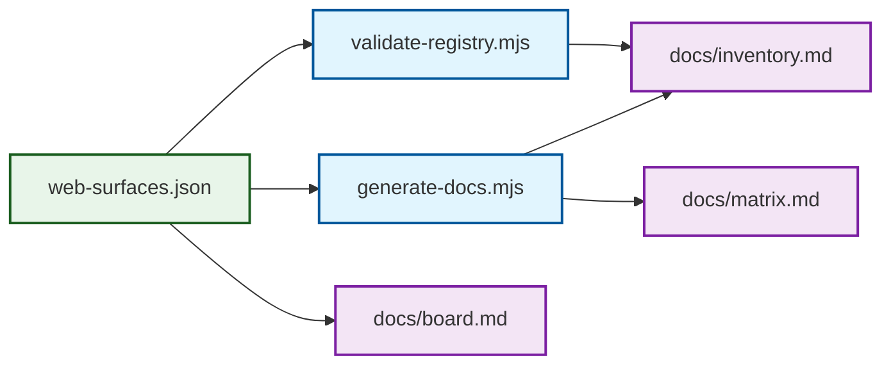

# Board

> The operating model for OpenSIN web surfaces.

## Canonical rule set

- One canonical registry: `registry/web-surfaces.json`
- One human inventory: `docs/inventory.md`
- One mapping matrix: `docs/matrix.md`
- One governance board: this file
- Unknowns are allowed, but they must be labeled as unknown or unverified

## Operating model

## State of the art best practice

1. **Registry-first** — never maintain domain lists in free text alone.
2. **Generated views** — inventory and matrix should be derived from the registry.
3. **Route groups over page dumps** — use prefixes for large surfaces like docs.
4. **Label unknowns** — do not guess deploy targets or owners.
5. **Separate concerns** — marketing, app, docs, API, community, and legacy surfaces are distinct classes.
6. **Keep ownership explicit** — every live surface has an owner and a purpose.

## Decision log

| ID | Decision | Why |
|---|---|---|
| D-001 | `registry/web-surfaces.json` is the SSOT | It can be validated and regenerated automatically. |
| D-002 | `docs/inventory.md` and `docs/matrix.md` are generated views | Keeps the human views in sync with the registry. |
| D-003 | Unknowns stay in the registry as `needs-verification` or `unverified` | Prevents hallucinated infrastructure. |
| D-004 | Subpages are route groups, not separate repos | Avoids false repo proliferation. |

## Open questions

- Which repo is canonical for `my.opensin.ai`?
- Which repo powers `blog.opensin.ai`?
- Is `hermes.opensin.ai` active or just a planned surface?
- Should `chat.opensin.ai/agents/*` live under the app or the public catalog?
- Is `delqhi-sin-stripe.hf.space` still a valid runtime target or just a legacy reference?
