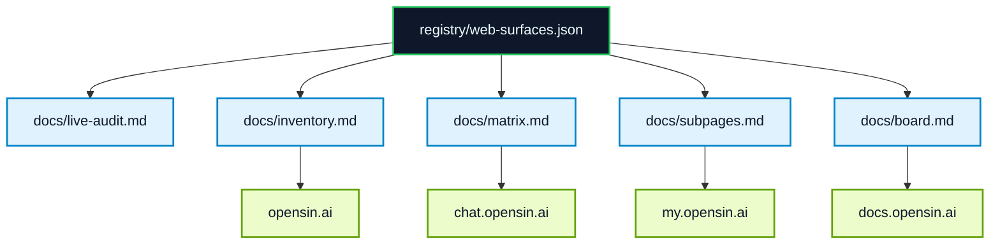

# Overview

> CEO view of the OpenSIN-AI web surface map.

## The system in one picture

## Status at a glance

| Surface | State | What it means |
|---|---|---|
| `opensin.ai` | Live | Marketing surface is reachable and route-rich. |
| `chat.opensin.ai` | Live / gated | Dashboard is live; agent pages can require login. |
| `my.opensin.ai` | Live | Marketplace and pricing surface is reachable. |
| `blog.opensin.ai` | Live | Blog resolves via Cloudflare Pages. |
| `docs.opensin.ai` | Live | Docs are the canonical knowledge layer. |
| `api.opensin.ai` | Internal | Backend surface is tracked, but public DNS is not consistently resolvable from this environment. |
| `opensin.ai/agents` | 404 | Not present in the current public source and should not be advertised as live. |
| `hermes.opensin.ai` | Unresolved | No public DNS resolution in audit. |
| `code-analyzer.opensin.ai` | Unresolved | No public DNS resolution in audit. |
| `delqhi-sin-stripe.hf.space` | 404 | Legacy HF runtime reference is not live. |

## Where to go next

- [`docs/live-audit.md`](live-audit.md) — live probe report
- [`docs/subpages.md`](subpages.md) — source-backed subpage inventory
- [`docs/inventory.md`](inventory.md) — generated surface list
- [`docs/matrix.md`](matrix.md) — domain/repo/deploy matrix
- [`docs/board.md`](board.md) — operating rules and decisions

## Best practice

The state of the art is:

1. Registry first.
2. Generated views second.
3. Live audit third.
4. Human docs stay opinionated, not speculative.
